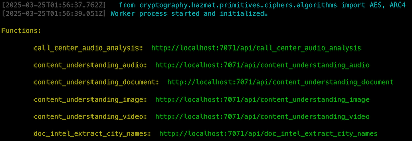

<!-- YAML front-matter schema: https://review.learn.microsoft.com/en-us/help/contribute/samples/process/onboarding?branch=main#supported-metadata-fields-for-readmemd -->

# Azure Multimodal AI + LLM Processing Accelerator

##### Table of Contents

- [Azure Multimodal AI + LLM Processing Accelerator](#azure-multimodal-ai--llm-processing-accelerator)
  - [Overview](#overview)
    - [Solution Design](#solution-design)
    - [Key features](#key-features)
    - [Why use this accelerator?](#why-use-this-accelerator)
    - [Example pipeline output](#example-pipeline-output)
    - [Prebuilt pipelines](#prebuilt-pipelines)
    - [Common Scenarios and use cases](#common-scenarios--use-cases)
    - [Roadmap & upcoming features](#roadmap--upcoming-features)
    - [FAQ](#faq)
  - [Deployment](#deployment)
    - [Pricing Considerations](#pricing-considerations)
    - [Deploying to Azure with azd](#deploying-to-azure-with-azd)
    - [Running the solution locally](#running-the-solution-locally)
  - [Credits](#credits)
  - [Contributing](#contributing)
  - [Trademarks](#trademarks)

## Overview

This accelerator is as a customizable code template for building and deploying production-grade data processing pipelines that incorporate Azure AI services and Azure OpenAI/AI Studio LLM models. It uses a variety of data pre-processing and enrichment components to make it easy to build complex, reliable and accurate pipelines that solve real-world use cases. If you'd like to use AI to **summarize, classify, extract or enrich** your data with structured and reliable outputs, this is the code repository for you.

### Solution Design


### Key features

- **Backend processing:** A pre-built Azure Function App, along with a number of pre-built processing pipeline blueprints that can be easily modified and deployed.
- **Front-end demo app:** A simple demo web app to enable internal testing of the backend APIs via a UI, and make it easier to collaborate with non-technical users.
- **Choice of Azure Content Understanding or custom pipelines:** Since releasing this accelerator, Microsoft has released the [Azure Content Understanding service](https://learn.microsoft.com/en-au/azure/ai-services/content-understanding/overview). This accelerator gives you the choice of using either Azure Content Understanding or custom preprocessing + LLM pipelines for your workflows.
- **Data converters and processors:** Many of the core components required for multimodal processing are included, such as [Azure Document Intelligence](https://azure.microsoft.com/en-us/products/ai-services/ai-document-intelligence), [Azure AI Speech](https://azure.microsoft.com/en-us/products/ai-services/ai-speech), [Azure OpenAI](https://azure.microsoft.com/en-us/products/ai-services/openai-service) and more. These help you easily convert your data into the format expected by LLMs, and the blueprints are built in an open way so that you can easily incorporate custom-built components.
- **Enriched outputs & confidence scores:** A number of components are included for combining the outputs of pre-processing steps with the LLM outputs. For example, adding confidence scores, bounding boxes, writing styles to the values extracted by the LLM. This allows for reliable automation of tasks instead of having to trust that the LLM is correct (or reviewing every result).
- **Data validation & intermediate outputs:** All pipelines are built to return not just the final result but all intermediate outputs. This lets you reuse the data in other downstream tasks.
- **Powerful and flexible:** The application is built in a way that supports both simple and complicated pipelines. This allows you to build pipelines for <u>all of your use cases</u> without needing to start from scratch with a new code base when you need to something a little more complex. A single deployment can support all of your backend processing pipelines.
- **Secure networking options:** Restrict access using either IP-based access rules or completely private networking configurations for enterprise-grade security.
- **Infrastructure-as-code:** An Azure Bicep template to deploy the solution and its required components using `azd`, including the option to enable only the backend services that are required for your use case.

### Why use this accelerator?

Most organisations have a huge number of simple and tasks and processes that consume large amounts of time and energy. These could be things like classifying and extracting information from documents, summarizing and triaging customer emails, or transcribing and running compliance tasks on contact centre call recordings. While some of these tasks can be automated with existing tools and services, they often require a lot of up-front investment to fully configure and customize in order to have a reliable, working solution. They can also be perform poorly when dealing with input data that is slightly different than expected, and may never be the right fit for scenarios that require the solution to be flexible or adaptable.

On the other hand, Large Language Models have emerged as a powerful and general-purpose approach that is able to handle these complex and varied situations. And more recently, with the move from text-only models to multimodal models that can incorporate text, audio and video, they are a powerful tool that we can use to automate a wide variety of everyday tasks. But while LLMs are powerful and flexible, they have their own shortcomings when it comes to providing precise and reliable outputs, and they too can be sensitive to the quality of raw and unprocessed input data.

| Approach + Examples  | Strengths | Weaknesses |
| ---------|---------|---------|
|**Domain-specific AI models**<br>- OCR<br>- Speech-to-text<br>- Object detection| - Generally better performance on specialized tasks<br>- Consistent performance and output format<br>- Cost-efficient & Scalable | - Outputs may require translation into human-friendly format<br>- Larger up-front development cost<br>- Tuning & customization may be more time-consuming<br>- Customized models may be less reliable/flexible with unseen data|
|**Large Language Models**<br>- Azure OpenAI<br>- Open Source Models | - Define behaviour with natural language<br>- Shorter up-front development time<br>- More flexible with wide-ranging input data<br>- Outputs are in human-friendly format |- Non-deterministic & lower reliability of outputs<br>- Harder to constrain & test (a black box)<br>- No consistent, structured metadata by default<br>- Uncalibrated, no confidence score (when can the outputs be trusted?)<br>- Expensive and slow, especially for transcription/translation tasks |

This accelerator provides the tools and patterns required to combine the best of both worlds in your production workloads, giving you the reasoning power, flexibility and development speed of Large Language Models, while using domain-specific AI during pre and post-processing to increase the consistency, reliability, cost-efficiency of the overall system.

### Example pipeline output

Here is an example of the pre-built [Form Field Extraction pipeline](#prebuilt-pipelines). By combining the structured outputs from Azure Document Intelligence with GPT-4o, we can verify and enrich the values extracted by GPT-4o with confidence scores, bounding boxes, style and more. This allows us to make sure the LLM has not hallucinated, and allows us to automatically flag the document for human review if the confidence scores do not meet our minimum criteria (in this case, all values must have a Document Intelligence confidence score above 80% to avoid human review).


#### Real-World Case Study

In a recent customer project that involved extracting Order IDs from scanned PDFs and phone images, we used a number of these techniques to increase the performance of GPT-4o-alone from ~60% to near-perfect accuracy:

- Giving GPT-4o the image alone resulted in an overall recall of 60% of the order IDs, and it was impossible to know whether the results for a single PDF could be trusted.
- Adding Document Intelligence text extraction to the pipeline meant the GPT-4o could use analyze both the image and extracted text. This increased the overall recall to over 80%.
- Many images were rotated incorrectly, and GPT-4o performed poorly on these files (around 50% recall). Document Intelligence returns a page rotation value in its response, and using this to correct those images prior to processing by GPT-4o drastically improved performance on those images - from 50% to over 80%.
- Finally, by cross-referencing the order IDs returned by GPT-4o against the Document Intelligence result, we could assign a confidence score to each of the extracted IDs. With these confidence scores, we were able to tune and set confidence thresholds based on the type of image, resulting in 100% recall on 87% of the documents in the dataset, with the rest of the images being automatically sent for human review.

At the conclusion of this project, our customer was able to deploy the solution and automate the majority of their processing workload with confidence, knowing that any cases that were too challenging for the LLM would automatically be escalated for review. Reviews can now be completed in a fraction of the time thanks to the additional metadata returned with each result.

### Prebuilt pipelines

The accelerator comes with these pre-built pipeline examples to help you get started. Each pipeline is built in its own python file as a [function blueprint](https://learn.microsoft.com/en-us/azure/azure-functions/functions-reference-python?tabs=get-started%2Casgi%2Capplication-level&pivots=python-mode-decorators#blueprints), and then imported and added to the main function app within `function_app/function_app.py`.

| Example  | Description & Pipeline Steps|
| ---------|---------|
|**Azure Content Understanding Pipelines**<br>**(HTTP)**<br>Code: [Document](/function_app/bp_content_understanding_document.py), [Video](/function_app/bp_content_understanding_video.py), [Audio](/function_app/bp_content_understanding_audio.py), [Image](/function_app/bp_content_understanding_image.py)| Uses Azure Content Understanding Service to process Document, Video, Audio and Image modalities, along with some minor post-processing & enrichment.<br>- Azure Content Understanding (Input file -> structured outputs)<br>- Custom post-processing<br>- Return structured JSON |
|**Form Field Extraction with Confidence Scores & bboxes**<br>**(HTTP)**<br>[Code](/function_app/bp_form_extraction_with_confidence.py)| Extracts key information from a PDF form and returns field-level and overall confidence scores and whether human review is required.<br>- PyMuPDF (PDF -> Image)<br>- Document Intelligence (PDF -> text)<br>- GPT-4o (text + image input)<br>- Post-processing:<br><ul>- Match LLM field values with Document Intelligence extracted lines<br>- Merge Confidence scores and bounding boxes<br>- Determine whether to human review is required</ul>- Return structured JSON |
|**Call Center Analysis with Confidence Scores & Timestamps**<br>**(HTTP)**<br>[Code](/function_app/bp_call_center_audio_analysis.py)| Processes a call center recording, classifying customer sentiment & satisfaction, summarizing the call and next best action, and extracting any keywords mentioned. Returns the response with timestamps, confidence scores and the full sentence text for the next best action and each of the keywords mentioned.<br>- Azure AI Speech (Speech -> Text)<br>- GPT-4o (text input)<br>- Post-processing:<br><ul>- Match LLM timestamps to transcribed phrases<br>- Merge sentence info & confidence scores</ul>- Return structured JSON |
|**Form Field Extraction**<br>**(Blob -> CosmosDB)**<br>Code: [Func](/function_app/function_app.py#L19.py), [Pipeline](/function_app/extract_blob_field_info_to_cosmosdb.py)| Summarizes text input into a desired style and number of output sentences.<br>- Pipeline triggered by blob storage event<br>- PyMuPDF (PDF -> Image)<br>- Document Intelligence (PDF -> text)<br>- GPT-4o (text + image input)<br>- Write structured JSON result to CosmosDB container. |
|**Summarize Text**<br>**(HTTP)**<br>[Code](/function_app/bp_summarize_text.py)| Summarizes text input into a desired style and number of output sentences.<br>- GPT-4o (text input + style/length instructions)<br>- Return raw text |
|**PII Identification & Redaction**<br>**(HTTP)**<br>[Code](/function_app/bp_pii_redaction.py)| Identifies and redacts PII entities in text and documents.<br>- [Optional] Document Intelligence (PDF -> text)<br>- Azure AI Language (text -> PII entities)<br>- Return text or PDF with all PII entities redacted in-place. |
|**Multimodal Document Intelligence Processing**<br>**(HTTP)**<br>[Code](/function_app/bp_multimodal_doc_intel_processing.py)| A pipeline showcasing the highly configurable Document Intelligence Processor that intelligently processes the raw Doc Intelligence API response to extract text, images and tables from a PDF/image into a more usable and flexible format.<br>- Document Intelligence (PDF/image -> text + images + tables)<br>- Return content as Markdown |
|**City Names Extraction, Doc Intelligence**<br>**(HTTP)**<br>[Code](/function_app/bp_doc_intel_extract_city_names.py)| Uses GPT-4o to extract all city names from a given PDF (using text extracted by Document Intelligence).<br>- Document Intelligence (PDF/image -> text)<br>- GPT-4o (text input)<br>- Return JSON array of city names |
|**City Names Extraction, PyMuPDF**<br>**(HTTP)**<br>[Code](/function_app/bp_pymupdf_extract_city_names.py)| Uses GPT-4o to extract all city names from a given PDF/image + text (extracted locally by PyMuPDF).<br>- PyMuPDF (PDF/image -> text & images)<br>- GPT-4o (text + image input)<br>- Return JSON array of city names |

These pipelines can be duplicated and customized to your specific use case, and should be modified as required. The pipelines all return a large amount of additional information (such as intermediate outputs from each component, time taken for each step, and the raw source code) which will usually not be required in production use cases. Make sure to review the code thoroughly prior to deployment.

### Demo web app

The accelerator comes with an included web app for demo and testing purposes. This webapp is built with [Gradio](https://www.gradio.app/), a lightweight Python UI library, to enable interaction with the backend pipelines from within the browser. The app comes prebuilt with a tab for each of the prebuilt pipelines, along with a few example files for use with each pipeline. The demo app also

### Common scenarios & use cases

- **Call centre analysis:** Transcribe and diarize call centre audio with Azure AI Speech, then use Azure OpenAI to classify the call type, summarize the topics and themes in the call, analyse the sentiment of the customer, and ensure the customer service agent complied with standard procedures (e.g. following the appropriate script, outlining the privacy policy and sending the customer a Product Disclosure Statement).

- **Document processing:** Ingest PDFs, Word documents and scanned images, extract the raw text content with Document Intelligence, then use Azure OpenAI to classify the document by type, extract key fields (e.g. contact information, document ID numbers), classify whether the document was stamped and signed, and return the result in a structured format.
- **Insurance claim processing:** Process all emails and documents in long email chains. Use Azure Document Intelligence to extract information from the attachments, then use Azure OpenAI to generate a timeline of key events in the conversation, determine whether all required documents have been submitted, summarize the current state of the claim, and determine the next-best-action (e.g. auto-respond asking for more information, or escalate to human review for processing).
- **Customer email processing:** Classify incoming emails into categories, summarizing their content, determining the sender's sentiment, and triage into a severity category for human processing.

### Roadmap & upcoming features

This accelerator is in active development, with a list of upcoming features including:

- **Additional Azure AI Services components:** Expand the number of pre-built Azure AI Services components (e.g. Language, Translation and more), while removing dependencies on external libraries where possible.
- **Additional pipeline examples:** A number of additional pipeline examples showcasing other data types/use cases and more advanced pipeline approaches.
- **Evaluation pipelines:** Example evaluation pipelines to evaluate overall performance, making it easy to iterate and improve your processing pipelines and help you select the right production thresholds for accepting a result or escalating to human review.
- **Async processing:** Ensure all included pipeline components have async versions for maximum performance & concurrency.
- **Other input/output options:** Additional pipelines using streaming and websockets.
- **Deployment pipeline:** An example deployment pipeline for automated deployments.

To help prioritise these features or request new ones, please head to the Issues section of this repository.

### FAQ

**What is the difference between Azure Content Understanding and the custom pipeline approach?**

Since the release of this accelerator, Microsoft has released the [Content Understanding Service](https://azure.microsoft.com/en-au/pricing/details/content-understanding/). The Content Understanding Service and how it works under the hood is 80-90% the same as what happens in the custom pipelines that are available within this accelerator, however there are a few reasons why you might want to choose one or the other.

| | Azure Content Understanding Service  | Custom Pipelines |
|---------|---------|---------|
|**Pros**| - Simpler setup, deployment and development<br>- Unified API for all data modalities<br>- Low maintenance & receive ongoing improvements & updates (managed service)| - Support in most Azure regions<br>- Full support for advanced & complicated workflows<br>- Ability to use custom system instructions & context data (e.g. RAG data or instructional/technical documentation)<br>- Full control over pre/post-processing steps & LLM models<br>- Support for more complex workflows (e.g. multistep summarization or [MapReduce](https://js.langchain.com/v0.1/docs/modules/chains/document/map_reduce/) patterns)<br>- Lower cost|
|**Cons**| - Preview service with limited regional availability [(3 regions as of March 2025)](https://learn.microsoft.com/en-us/azure/ai-services/content-understanding/language-region-support?tabs=document)<br>- No support for LLM system prompts or additional context (beyond field-level definitions & examples)<br>- Less flexibility & control for advanced use cases<br>- Confidence scores only available for documents<br>- No summarization support for documents (only field extraction)<br>- Higher cost | - Requires higher technical capability<br>- More complex infrastructure & deployment<br>- Requires ongoing maintainance<br>- No support (yet) for video files|

In general, the Azure Content Understanding service is a great fit for use cases where simplicity and ease of use is important, and where the improved accuracy, customization and cost efficiency of a custom solution is not necessary. It serves as the simpler starting point for most dev teams, while still having the option to switch to the custom processing pipelines if the need arises. It is recommended to start with Azure Content Understanding and then move to custom pipelines when required.

**How can I get started with a solution for my own use case?**

The demo pipelines are examples and require customization in order to have them work accurately in production. The best strategy to get started is to clone one of the existing demo pipelines and modify them for your own purpose. The following steps are recommended:

1. Fork this repository into your own Github account/organization, then clone the repository to your local machine.
1. Follow the instructions in the [deployment section](#deployment) to setup and deploy the code, then test out some of the demo pipelines to understand how they work.
1. Walk through the code for the pipelines that are the most similar to what you would like to build, or which have the different components that you want to use.
    - For example, if you want to build a document extraction pipeline, start with the pipelines that use Azure Document Intelligence.
    - If you want to then combine this with AI Speech or with a different kind of trigger, look through the other pipelines for examples of those.
    - Once familiar with the example pipelines, you should be able to see how you can plug different pipeline components together by into an end-to-end solution.
    - If you are deploying a use case that only requires certain functionality, you may want to disable any of the pipelines that are not required for your use case. To do this, you can simply comment or delete the import statements and route registration code within the [function_app.py](function_app/function_app.py). This will ensure that those pipelines are not loaded when the function app starts.
1. Clone the python blueprint file (e.g. `function_app/bp_<pipeline_name>.py`) that is most similar to your ideal use case, renaming it and using it as a base to start with.
1. Review and modify the different parts of the pipeline. The common things are:
    1. The AI/LLM components that are used and their configurations.
    1. The Azure Function route and required input/output schemas and validation logic.
    1. For Content Understanding pipelines:
        1. Review the [Content Understanding service documentation](https://learn.microsoft.com/en-au/azure/ai-services/content-understanding/service-limits).
        1. Review and modify the [Content Understanding schema definitions](function_app/config/content_understanding_schemas.json) (you will need to create or recreate these analyzer schemas when any changes occur using [this script](function_app/create_content_understanding_analyzers.py))
    1. For Custom pipelines:
        1. The Pydantic classes and definitions that define the schema of the LLM's response and the response to be returned from the API.
            - The repo includes a useful Pydantic base model (LLMRawResponseModel) that makes it easy to print out the JSON schema in a prompt-friendly way, and it is suggested to use this model to define your schema so that you can easily provide it to your model and then validate the LLM's responses.
            - By default, these include a lot of additional information from each step of the pipeline, but you may want to remove, modify or add new fields.
        1. The LLM system prompt(s), which contain instructions on how the LLM should complete the task.
            - All prompt examples in this repo are very basic and it is recommended to spend time crafting detailed instructions for the LLM and including some few-shot examples.
            - These should be in addition to the JSON schema definition - if you use the JSON schema alone, expect that the model will make a number of mistakes (you can see this occur in some of the example pipelines).
        1. The post-processing validation logic. This is how you automatically determine when to trust the outputs and when to escalate to human review.
1. Once you have started making progress on the core processing pipeline, you may want to modify the demo web app (`demo_app/`) so that you can easily test the endpoint end-to-end.
    - The Gradio app has a tab built for each of the Function app pipelines, and you should start with the code built for the base of your new function app pipeline.
    - If you need different data inputs or a different request schema (e.g. switching from sending a single file to a file with other JSON parameters), check out each of the other pipelines. These will help you determine how to build the front-end and API request logic so that things work end-to-end.
    - Once you have these working together, you can easily iterate and test your pipelines quickly with the demo web app via the UI.
1. When your pipeline is working end-to-end, it's time to think about testing & evaluating the accuracy and reliability of your solution.
    - It is critical with any AI system to ensure that the pipeline is evaluated on a representative sample of validation data.
    - Without this, it is impossible to know how accurate the solution is, or whether the solution fails under specific circumstances. This is often the time-consuming step of building and deployment an AI solution but is also the most important.
    - While more tools to help simplify this process are coming soon, you should take a look at the [evaluation tools within Azure AI Studio](https://learn.microsoft.com/en-us/azure/ai-studio/how-to/evaluate-generative-ai-app).
1. Finally, it's time to deploy your custom application to Azure.
    - Review and modify the infrastructure templates and parameters to ensure the solution is deployed to your requirements
    - Setup automated CI/CD deployment pipelines using Github Actions or Azure DevOps (base templates are coming to the repo soon).

**Does this repo use or support Langchain/Llamaindex/Framework X?**

There are many different frameworks available for LLM/Generative AI applications, each offering different features, integrations, and production suitability. This accelerator uses some existing components from [Haystack](https://haystack.deepset.ai/overview/intro), but it is framework agnostic and you can use any or all frameworks for your pipelines. This allows you to take advantage of the solution architecture and many of the helper functions while still having full control over how you build your pipeline logic.

**What about a custom UI?**

The majority of applications built using this accelerator will be integrated into existing software platforms such as those use in call centres, customer support, case management, ERP platforms and more. Integrating with these platforms typically requires an API call or an event-driven database/blob trigger so that any processing done by this accelerator can seamlessly integrate with any existing workflows and processes (e.g. to trigger escalations, human reviews, automated emails and more).

While a demo application is included in this repository for testing your pipelines, the accelerator is built to prioritise integrations with other software platforms. If you would like a more advanced UI, you can either build your own and have it call the Azure Function that is deployed by this accelerator, or look at other accelerators that may offer more narrow and specialized solutions for specific use cases or types of data.

**Can I use existing Azure resources?**

Yes - you'll need to modify the Bicep templates to refer to existing resources instead of creating new ones. See [here](https://learn.microsoft.com/en-us/azure/azure-resource-manager/bicep/existing-resource) for more info.

**How can I integrate with other triggers?**

- Azure Functions provides many different input & output bindings out of the box, including HTTP, Blob, CosmosDB, Event Grid and more. See [here](https://learn.microsoft.com/en-us/azure/azure-functions/functions-triggers-bindings?tabs=isolated-process%2Cpython-v2&pivots=programming-language-python) for examples showing how you can use these in your pipelines.

## Deployment

### Pricing considerations

This solution accelerator deploys multiple resources. Evaluate the cost of each component prior to deployment.

The base cost of the solution is the cost to host the Function App, plus the Web app and private endpoints (if they are enabled). The cost of the default Premium App Service plan is approximately $60 USD/month (depending on your region), multiplied by 2 if you also deploy the demo web app. Once you start using the solution, your cost will then be based purely on your usage of each of the backend services (OpenAI, Document Intelligence, Speech, Language, Content Understanding).

The following are links to the pricing details for all resources:

- [Azure OpenAI service pricing](https://azure.microsoft.com/pricing/details/cognitive-services/openai-service/).
- [Azure Content Understanding pricing](https://azure.microsoft.com/en-au/pricing/details/content-understanding/)
- [Azure AI Document Intelligence pricing](https://azure.microsoft.com/pricing/details/ai-document-intelligence/)
- [Azure AI Speech pricing](https://azure.microsoft.com/en-au/pricing/details/cognitive-services/speech-services/)
- [Azure AI Language pricing](https://azure.microsoft.com/en-us/pricing/details/cognitive-services/language-service/)
- [Azure Functions pricing](https://azure.microsoft.com/pricing/details/functions/)
- [Azure Web App Pricing](https://azure.microsoft.com/pricing/details/app-service/linux/)
- [Azure Blob Storage pricing](https://azure.microsoft.com/pricing/details/storage/blobs/)
- [Azure Key Vault pricing](https://azure.microsoft.com/en-us/pricing/details/key-vault/)
- [Azure Monitor pricing](https://azure.microsoft.com/en-us/pricing/details/monitor/)
- [Azure Private Endpoints pricing](https://azure.microsoft.com/en-us/pricing/details/private-link/)

### Networking configuration

The solution includes comprehensive networking options to support both development scenarios and enterprise security requirements.

#### Network architecture overview

The infrastructure deploys a Virtual Network (VNET) with the following subnets:

- **Frontend subnet**: Contains the demo web application (if deployed). Has access to the Function App and shared storage/KV services.
- **Function App subnet**: Contains the Azure Function App. Has access to backend AI services and shared storage/KV services.
- **Backend services subnet**: Contains the backend AI resources (OpenAI, Document Intelligence, Speech, Language, Content Understanding) and optionally their private endpoints. Only accessible from the Function App subnet by default.
- **Storage services subnet**: Contains the shared storage/KV services (Storage Account and CosmosDB), and optionally their private endpoints. Accessible from both the Function App and Frontend subnets. Accessible from the Frontend and function app subnets by default.
- **Function App private endpoint subnet**: Contains the private endpoint for the Function App when using private networking. Accessible from the Frontend subnet only.

**Network endpoint types**:
By default, all of the resources deployed in this accelerator communicate with each other using either Service Endpoints or Private Endpoints.

1. Private Endpoints - This deploys a private endpoint for the group of resources and ensures all traffic from other resources in the VNET stays within the VNET (no data traverses the public internet).
2. Service Endpoints - This uses Service Endpoints & NACL/IP rules to control internal VNET traffic, while ensuring the traffic stays within the Azure backbone network.

The choice between Service Endpoints and Private Endpoints can be made independently for each group of resources.

- `backendServicesNetworkingType`: Controls how the backend AI services are accessed by the web & function apps (ServiceEndpoint or PrivateEndpoint)
- `storageServicesAndKVNetworkingType`: Controls how shared storage services & Key Vault are accessed by the web and function apps (ServiceEndpoint or PrivateEndpoint)
- `functionAppNetworkingType`: Controls how the Function App can be accessed by the web app (ServiceEndpoint or PrivateEndpoint)
- `webAppUsePrivateEndpoint`: Controls whether a private endpoint is deployed for the web app (provided that the web app is deployed)

Additionally, you can optionally allow public network access to the resources using the `*AllowPublicAccess` & `*AllowedExternalIpsOrIpRanges` parameters. This is useful for when you need to deploy the solution from outside of the VNET but want to ensure that the resources communicate with each other via private endpoints. More information on this scenario is available in the [Private endpoint considerations](#private-endpoint-considerations) section below.

For more information, check out the configuration options within the `infra/main.bicepparam` file.

#### When to use each networking option

**Service Endpoints**:

- Best for development scenarios or when public access is required
- Allows controlled public access from specified IP addresses
- Simpler to set up and use when deveoping locally
- No cost overhead
- Typical scenarios: Local development, dev/sandbox environments, or applications where private networking of backend services is not required.

**Private Endpoints**:

- Best for enterprise security requirements, providing the highest level of security
- Recommended for production environments with strict security requirements
- Can completely isolates services from the public internet - all traffic that originates from within the VNET will stay within the VNET
- Adds a small cost overhead (approximately $7.50 per month per private endpoint, which can total $60-75/month when using private endpoints for all services)
- Typical scenarios: Production environments, and applications where private networking is required.

#### Private endpoint considerations

When using private endpoints:

1. **Local development challenges**: Services with private endpoints are not directly accessible from your local development environment unless public network access is enabled temporarily for deployment. If public network access must be disabled at all times, you will need to run the deployment from an internal network address (within the VNET). Options to address this include:
   - Using a jumpbox or Azure Bastion service to access the VNET
   - Setting up a VPN connection to the VNET
   - Using Azure Dev Tunnels or similar services

2. **Deployment of Content Undertstanding Schemas & Application Code**: After the provisioning of the cloud resources, a postprovision script is run from the deployment runner (or your local machine) to create or update the Content Understanding analyzer schemas in the resource dedicated to Azure Content Understanding, along with deployment of the function app code. If either the Content Understanding resource or the function app resources are deployed behind without public network access and from a deployment host that is not located within the VNET, these steps will fail. There are a couple ways to resolve this:
    - The recommended long-term solution is to run the deployment from a host that is located within or connected to the VNET (e.g. via a VPN or Azure Bastion, or from a VM/runner that is deployed within the VNET).
    - Alternatively, you can temporarily deploy the solution with public network access enabled and then reprovision the infrastructure with all public network access disabled. In practice, you would do as follows:
        - For the first deployment, enable public network access for the resources (within `main.bicepparam`), then run `azd up`. This will create the schemas in the Content Understanding resource and deploy the application code while public access is possible.
        - Now that the schemas and code are deployed and up-to-date, set the `webAppAllowPublicAccess`, `functionAppAllowPublicAccess`, `backendServicesAllowPublicAccess` parameters to false.
        - Redeploy the infrastructure by running `azd provision`. This will disable public network access to the resources and ensure that only other resources within the VNET can access them.
        - Next time you need to update the schemas or application code, you can temporarily re-enable public network access to the required resources, rerun `azd up` to reprovision the infrastructure and deploy the updated schemas and application code, and then disable public network access and run `azd provision` once more.

### Prerequisites for deployment and local development

- Deployment of this accelerator tends to work more reliably when deploying from a unix-based system (e.g. MacOS or Linux). It is recommended that Windows users deploy using [Windows Subsystem for Linux (WSL)](https://learn.microsoft.com/en-us/windows/wsl/install) to execute the following commands from the Linux command line.
  - If WSL is not available and you must run commands from the Windows command line, you will need to make sure that `Powershell (Core) 7` is installed (so that `pwsh` commands can be run). This is a different to `Windows Powershell` which comes pre-installed on all Windows systems.
  - To verify whether Powershell (Core) is installed, you can run `pwsh --version`. If the command is not found, run `winget install --id Microsoft.PowerShell --source winget` to install it.
  - Once installed, make sure to run all commands below from the Windows Powershell command line (otherwise the `az` and `azd` commands may not work correctly).
- To use and deploy this solution accelerator, you will need access to an Azure subscription with permission to create resource groups and resources. You can [create an Azure account here for free](https://azure.microsoft.com/free/).
- Clone this repository: `git clone https://github.com/azure/multimodal-ai-llm-processing-accelerator.git`
- Create a new Python 3.11 environment for your project.
  - To do this, open a terminal window and navigate to the root directory of the repository. You can then use a package manager like `conda`, `venv` or `virtualenv` to create the environment - below are some example commands:
    - Anaconda: `conda create -n mm_ai_llm_processing_accelerator python=3.11 --no-default-packages`, then activate the environment with `conda activate mm_ai_llm_processing_accelerator` each time you want run or deploy the solution.
    - venv: `python -m venv .venv`, then activate the environment with `source .venv/bin/activate` each time you want run or deploy the solution.
  - Once the new environment is created and activated, install the python requirements file: `pip install -r requirements.txt`. This contains the dependencies for both the function and web apps.
  - Make sure you have activated the environment each time you need to deploy the solution or run it locally.
- Install the [Azure CLI](https://learn.microsoft.com/en-us/cli/azure/install-azure-cli) (`az`) and login using `az login`.
- Install the [Azure Developer CLI](https://learn.microsoft.com/en-us/azure/developer/azure-developer-cli/install-azd) (`azd`) and login using `azd auth login`.

### Deploying to Azure with `azd`

#### Deploying for the first time

Execute the following command, if you don't have any pre-existing Azure services and want to start from a fresh deployment.

1. Ensure your virtual environment is activated
1. Run `azd auth login`
1. Review the default parameters in `infra/main.bicepparam` and update as required. At a minimum, make sure to update the `additionalRoleAssignmentIdentityIds` parameter with your identity ID and review the networking configuration (see the file for instructions).
1. Run `azd up` to start the deployment. Follow the prompts to create or select the resource group, location and other parameters. This will provision the Azure resources and deploy the services.

> [!WARNING]
> When deploying for the first time, you may receive a `ServiceUnavailable` error when attempting to deploy the apps after provisioning. This is due to a known bug when retrieving the function key for a newly deployed Azure Function. If this error occurs, simply wait 1-2 minutes and then rerun `azd deploy`. The deployment should then complete successfully.

5. After the application has been successfully deployed you will see the Function App and Web App URLs printed to the console. Open the Web App URL to interact with the demo pipelines from your browser.
It will look like the following:


#### Deploying again

Whenever you rerun any deployment commands, make sure you have activated your Python 3.11 virtual environment.

If you've only changed the infrastructure files (`infra` folder or `azure.yaml`) or the [Content Understanding schema definitions](function_app/config/content_understanding_schemas.json), then you'll only need to run the provisioning step to update the Azure resources. You can do that by running:

- ```azd provision```

If you've only changed the function or web app code, then you don't need to re-provision the Azure resources. You can redeploy the application code using one of the following commands:

- ```azd deploy --all``` to deploy both the api and web app code
- ```azd deploy api``` to deploy the function app code only
- ```azd deploy webapp``` to deploy the web app code only

If you've changed both the infrastructure files, schemas or the function or web app code, then you'll need to re-provision the Azure resources and redeploy the services. You can do that by running:

- ```azd up```

#### Clean up

To clean up all the resources created by this sample:

1. Remove any model deployments within the AOAI resource. If not removed, these may the resource cleanup to fail.
1. Run `azd down --purge`. This will permanently delete the resource group and all resources.

### Running the solution locally

#### Prerequisites

- Make sure to complete the prerequisites in the [Prerequisites for deployment and local development](#prerequisites-for-deployment-and-local-development) section.
- For local development, install [Azure Functions Core Tools](https://learn.microsoft.com/en-us/azure/azure-functions/functions-run-local?tabs=v4%2Cmacos%2Ccsharp%2Cportal%2Cbash#install-the-azure-functions-core-tools) so that you can run the function app server locally.
- Deploy the backend Azure resources
  - To run the solution locally, you will need to create the necessary resources for all Storage, CosmosDB and Azure AI service calls (e.g. Azure Document Intelligence, Azure OpenAI etc). To do this, it is recommended to first deploy the solution to Azure using `azd up` and with Service Endpoints enabled for the backend services, along with public network access from your local computer. This will provision the necessary backend resources that can now be called by the locally running function app.
  - If using the Azure Content Understanding service in your pipelines, ensure that any changes to the analyzer schemas are updated within the Azure resource before you test your pipelines locally. Whenever you update any of the [Content Understanding schema definitions](/function_app/config/content_understanding_schemas.json), you can push the new definitions to the Azure resource using the [create_content_understanding_analyzers.py](function_app/create_content_understanding_analyzers.py) script or by simply running `azd provision` again (the schemas are automatically updated within the Azure resource using a [postprovision script](/azure.yaml) whenever the infrastructure is re-deployed to Azure).
- If using the Azure Storage bindings in your pipelines (e.g. for Azure Blob Storage input triggers), you can either connect directly to an Azure Storage account or you can test with a locally-running Storage Account emulator.
  - To use a locally-running Storage Account emulator, you will need to install and run the Azurite emulator before you start the function server.
    - The easiest way to run the Azurite emulator is using the [Azurite VS Code extension](https://marketplace.visualstudio.com/items?itemName=Azurite.azurite).
    - Once installed, click on the buttons in the bottom right-hand corner of the VS Code window to start or stop the server (see below). Once clicked, the emulator will start running:
    
    - Finally, you'll need to update the parameters for the function and web apps so that they upload and read from the emulated storage account.
      - Function App: Make sure the `AzureWebJobsStorage` parameter is set to `UseDevelopmentStorage=true` in the `function_app/local.settings.json` file.
      - Web App: Set the `USE_LOCAL_STORAGE_EMULATOR` parameter to `"true"` in the `demo_app/.env` file. When set to true, this will instruct the demo app to connect using the pre-set `LOCAL_STORAGE_ACCOUNT_CONNECTION_STRING` parameter (more info [here](https://learn.microsoft.com/en-us/azure/storage/common/storage-use-azurite?tabs=visual-studio%2Cblob-storage#https-connection-strings)).
  - To connect to a Azure Storage account that is deployed in Azure, you can use the following environment variables for each of the apps:
    - Function app - Ensure that `AzureWebJobsStorage` is **not** set within `function_app/local.settings.json`, and then set the following parameters based on the outputs in the azd .env file:
      - `AzureWebJobsStorage__accountName` (azd output field: `storageAccountName`)
      - `AzureWebJobsStorage__blobServiceUri` (azd output field: `storageAccountBlobUri`)
      - `AzureWebJobsStorage__queueServiceUri` (azd output field: `storageAccountQueueUri`)
      - `AzureWebJobsStorage__tableServiceUri` (azd output field: `storageAccountTableUri`)
    - Web app - In your .env file, use the following parameters:
      - Set the `USE_LOCAL_STORAGE_EMULATOR` parameter to `"false"`
      - Set the `STORAGE_ACCOUNT_ENDPOINT` parameter to the storage account endpoint (e.g. `"https://llmprocstorageXXXXX.blob.core.windows.net/"` )
  - If you've already deployed the solution, the parameters required for all of the instructions above will be stored in your azd environment output variables. These can be copied by running `azd env get-values` and then updating `function_app/local.settings.json` and `demo_app/.env` files with the corresponding values.

#### Function app local instructions

The `function_app` folder contains the backend Azure Functions App. By default, it includes a number of Azure Function Python Blueprints that showcase different types of processing pipelines.

- Open a new terminal/Windows Powershell window and activate your project's Python 3.11 environment (see [Prerequisites for deployment and local development](#prerequisites-for-deployment-and-local-development))
- Navigate to the function app directory: `cd function_app`
- When starting the function server, a number of environment variables are loaded from a configuration file in the `function_app` folder, called `local.settings.json`. To get started quickly, you can clone the sample file (`cp function_app/sample_local.settings.json function_app/local.settings.json`). More info on local Azure Functions development can be found [here](https://learn.microsoft.com/en-us/azure/azure-functions/functions-develop-local).
- Now review the newly created `local.settings.json` file. The file includes many placeholder values that should be updated to the correct values based on your azd deployment (these are usually capitalized, e.g. `DOC_INTEL_ENDPOINT` or `AOAI_ENDPOINT`).
  - The `sample_local.settings.json` file is configured by default to connect to a local Azurite storage account emulator for Azure Blob Storage bindings. To use this option, ensure the `AzureWebJobsStorage` parameter is set to `UseDevelopmentStorage=true` in the `local.settings.json` file, and then ensure that the Azurite emulator is installed on your system (e.g. using the [Azurite VS Code extension](https://marketplace.visualstudio.com/items?itemName=Azurite.azurite)) and that the local blob, file and queue servers are running locally on `127.0.0.1:10000`, `127.0.0.1:10001` and `127.0.0.1:10002`.
  - If you would like to instead connect to an Azure Storage Account deployed in Azure, ensure that `AzureWebJobsStorage` is **not** set (delete both the key and value from the json file), and then set the following parameters based on the outputs in the azd .env file:
    - `AzureWebJobsStorage__accountName` (update it to the azd output field: `storageAccountName`)
    - `AzureWebJobsStorage__blobServiceUri` (update it to the azd output field: `storageAccountBlobUri`)
    - `AzureWebJobsStorage__queueServiceUri` (update it to the azd output field: `storageAccountQueueUri`)
    - `AzureWebJobsStorage__tableServiceUri` (update it to the azd output field: `storageAccountTableUri`)
- Start the function server: `func start`
- Once the local web server is up and running, you can either run the demo app, or open a new terminal window and send a test request:
`sh send_req_summarize_text.sh`

After running the function server (either in your terminal window or in Azure), the logs should show the function server starting and each of the function routes loaded like so:



If you see an error, or that some or all of the functions are missing, it could mean a couple things:

1. The server started with 0 function routes or an exception was raised in the logs: This can occur due to an exception that occured when loading any of the pipelines. In general, if an exception occurs when importing and setting up any of the pipelines and their dependencies, it can cause all functions to fail. In this situation you will need to check for any code changes that may have caused issues and fix them (it is easiest to do this locally).
1. The server started, but some or all of the functions are missing when the server was started: When the function app starts, it check the environment variables for the necessary information of all backend services. If any of them are missing, it will skip the loading of that pipeline and the API route will not be available.
    - If this occurs locally, it will be because the `function_app/local.settings.json` file is missing some of the required environment variables defining the endpoints for Azure resources, causing the function app to skip the registration of any pipelines that depend on those resources. Make sure you have updated all of the placeholder values in `local.settings.json` to the correct values, so that the function app registers the pipelines that depend on them.
    - If this occurs with a function running in Azure, it may be because some of the required resources were not deployed. Check the `infra/main.bicepparam` file to make sure that all of the necessary AI and database resources were deployed. If they were, the environment variables will be automatically updated and the pipelines should then be loaded correctly.

#### Demo app local instructions

The `demo_app` folder contains the code for the demo web application. This application is built with the `gradio` Python web framework, and is meant for demos and testing (not production usage). The application connects to a Azure Functions server for all processing, automatically selecting the correct endpoint based on the `FUNCTION_HOST` and `FUNCTION_KEY` environment variables (which are set during deployment). If the web server is run locally without any environment variables set, it will attempt to automatically connect to a locally Function Server on `http://localhost:7071/`.

To run the demo app locally, follow these steps:

- Open a new terminal/Windows Powershell window and activate your project's Python 3.11 environment (see [Prerequisites for deployment and local development](#prerequisites-for-deployment-and-local-development))
- Navigate to the demo app directory: `cd demo_app`
- When the demo app web server starts, it uses environment variables to connect to the correct function server and backend services. To get started quickly, make a copy of the sample environment variables file: `cp .env.sample .env` and update it as follows:
  - Many of the values will need to be updated to the bicep deploylment outputs so that the local demo app can connect to the deployed services.
  - If you have already deployed the solution to Azure, these variables will be stored in your azd environment output variables. These can be copied by running `azd env get-values` and then updating your `.env` file with the corresponding values.
- Start the gradio server: `gradio demo_app.py`. By default, the application will launch in auto-reload mode, automatically reloading whenever `demo_app.py` is changed.
- Open the web app in the browser: `https://localhost:8000`

When using the demo web app, all requests will be sent to the function app (set by `FUNCTION_HOST`) for processing. If any of these requests fail and the gradio web app shows a 403 error as the result, it could be because the function host is not running or is unavailable, or that the specific pipeline that the request was sent to is not loaded/running on that function server. Review the previous function app section for more details on why this might occur and how to troubleshoot it.

# Credits

- [Michael Tremeer](https://github.com/michaeltremeer)

# Contributing

This project welcomes contributions and suggestions. Most contributions require you to agree to a
Contributor License Agreement (CLA) declaring that you have the right to, and actually do, grant us
the rights to use your contribution. For details, visit <https://cla.opensource.microsoft.com>.

When you submit a pull request, a CLA bot will automatically determine whether you need to provide
a CLA and decorate the PR appropriately (e.g., status check, comment). Simply follow the instructions
provided by the bot. You will only need to do this once across all repos using our CLA.

This project has adopted the [Microsoft Open Source Code of Conduct](https://opensource.microsoft.com/codeofconduct/).
For more information see the [Code of Conduct FAQ](https://opensource.microsoft.com/codeofconduct/faq/) or
contact [opencode@microsoft.com](mailto:opencode@microsoft.com) with any additional questions or comments.

# Trademarks

This project may contain trademarks or logos for projects, products, or services. Authorized use of Microsoft
trademarks or logos is subject to and must follow
[Microsoft's Trademark & Brand Guidelines](https://www.microsoft.com/en-us/legal/intellectualproperty/trademarks/usage/general).
Use of Microsoft trademarks or logos in modified versions of this project must not cause confusion or imply Microsoft sponsorship.
Any use of third-party trademarks or logos are subject to those third-party's policies.
